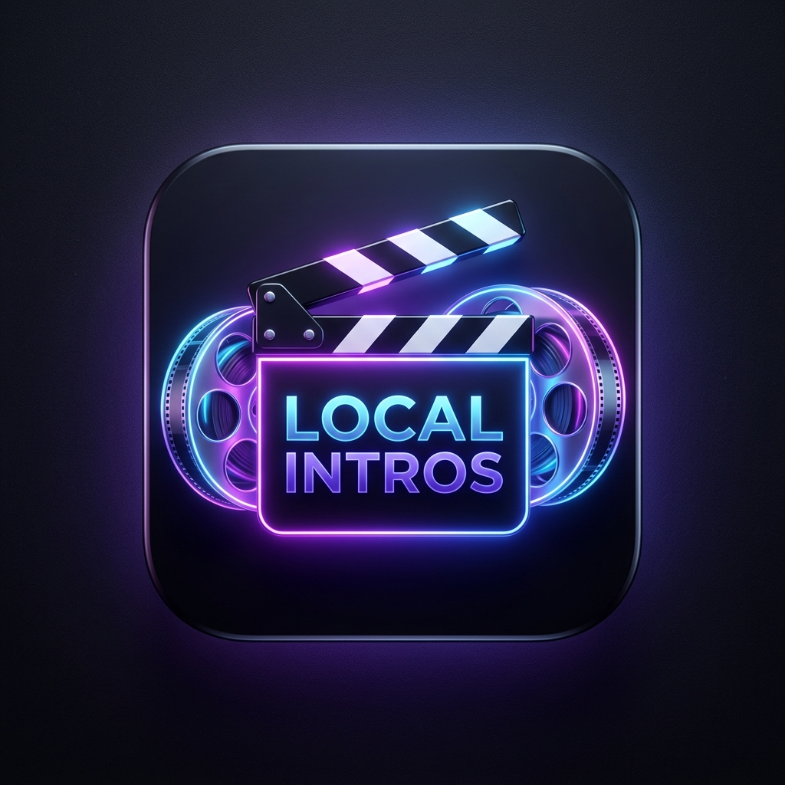
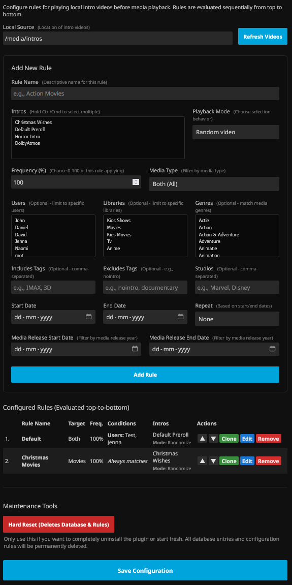

<p align="center">
  
</p>

<h1 align="center">Local Intros Extended for Jellyfin</h1>
<h3 align="center">Advanced, rule-based pre-roll intros for Jellyfin</h3>

<p align="center">
  <a href="https://github.com/dheinst/jellyfin-plugin-local-intros-extended/blob/main/LICENSE">
    
  </a>
  
  
</p>

## About

**Local Intros Extended** is an enhanced fork of the Jellyfin Intros plugin that plays local intro (pre-roll) videos before media playback. It replaces simple flat lists with a powerful **Rule Engine**, allowing you to combine multiple conditions, percentage chances, seasonal dates, and library filters for complete playback control.

---

## 📸 Screenshot



---

## ✨ Features

* **Sequential Evaluation (First-Match-Wins)**: Rules are evaluated sequentially from top to bottom. The first rule whose criteria match is applied. Order rules easily using the ▲ and ▼ buttons in the UI.
* **Frequency Chance (0-100%)**: Set a percentage probability for each rule. If a rule's conditions match, this roll determines whether it plays. If the roll fails, evaluation seamlessly moves on to subsequent rules.
* **Random vs Sequence Playback**: Choose whether a rule plays one random video from its assigned intro list or plays all selected intros in sequence.
* **Combinable Conditions**:
  * **Libraries**: Restrict intros to specific libraries (e.g., dedicated bumpers for Classic Movies, kid-friendly bumpers for Animations).
  * **Users**: Target specific user accounts.
  * **Genres & Studios**: Match against genres (Action, Horror, etc.) or studios (Pixar, Marvel, Warner Bros, etc.).
  * **Includes & Excludes Tags**: Whitelist or blacklist specific tags (e.g. tag a movie with `nointro` to skip intros).
  * **Current Date / Seasonal Ranges**: Trigger seasonal intros (Halloween, Christmas, summer) with optional Weekly, Monthly, or Yearly repeat schedules.
  * **Media Release Date Ranges**: Match movies by release year/date (e.g. vintage theater bumpers for 80s & 90s cinema).

---

## 📦 Installation Options

Choose the installation method that fits you best:

### Option 1: Via Jellyfin Repository (Recommended & Easiest)
*Best for most users: one-click installation, thumbnail artwork, and seamless updates directly from the Jellyfin dashboard.*

1. In your Jellyfin web client, go to **Dashboard** → **Plugins** → **Repositories** (tab at the top).
2. Click the **+** (Add) button.
3. Fill in the fields:
   * **Repository Name**: `Local Intros Extended`
   * **Repository URL**:
     ```text
     https://raw.githubusercontent.com/dheinst/jellyfin-plugin-local-intros-extended/main/manifest.json
     ```
4. Click **Save**.
5. Switch to the **Catalog** tab, find **Local Intros Extended** under *Movies and Shows*, and click **Install**.
6. Restart your Jellyfin server.

---

### Option 2: Pre-built Release (Manual)
*Best if you prefer not to add custom repositories to your server.*

1. Go to the [Releases](https://github.com/dheinst/jellyfin-plugin-local-intros-extended/releases) page and download the latest `LocalIntrosExtended_x.x.x.x.zip` (or `.dll`).
2. Navigate to your Jellyfin `plugins` folder:
   * **Linux / Docker**: `/config/plugins/`
   * **Windows**: `C:\ProgramData\Jellyfin\Server\plugins\`
3. Create a folder named `LocalIntrosExtended`:
   ```text
   plugins/LocalIntrosExtended/Jellyfin.Plugin.LocalIntrosExtended.dll
   ```
4. Place `Jellyfin.Plugin.LocalIntrosExtended.dll` into that folder.
5. Restart your Jellyfin server.

---

### Option 3: Build from Source (For Developers & Forks)
*Best if you want to modify the code or compile the binary yourself.*

1. Install the [.NET 10.0 SDK](https://dotnet.microsoft.com/download/dotnet/10.0) (or newer).
2. Clone this repository:
   ```bash
   git clone https://github.com/dheinst/jellyfin-plugin-local-intros-extended.git
   ```
3. Build the plugin:
   ```bash
   dotnet publish Jellyfin.Plugin.LocalIntrosExtended/Jellyfin.Plugin.LocalIntrosExtended.csproj --configuration Release --output bin
   ```
4. Copy the compiled `Jellyfin.Plugin.LocalIntrosExtended.dll` from the `bin/` folder into your Jellyfin `plugins/LocalIntrosExtended/` directory.
5. Restart your Jellyfin server.

---

## 📄 Credits & Attribution

* Forked and enhanced by [@dheinst](https://github.com/dheinst).
* Based on the original [Jellyfin Intros Plugin](https://github.com/jellyfin/jellyfin-plugin-intros) created by [@dkanada](https://github.com/dkanada).

---

## ⚖️ License

Distributed under the GNU GPL-3.0 License. See [LICENSE](./LICENSE) for details.
